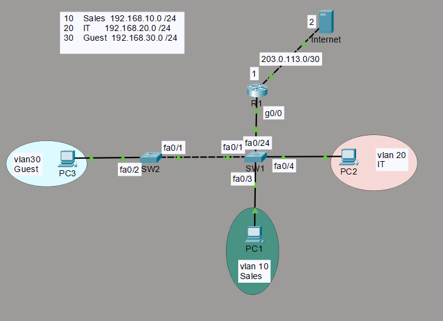

# Lab 1: Multi-VLAN Enterprise LAN with Inter-VLAN Routing

## Overview
This lab simulates a small enterprise LAN segmented into three VLANs (Sales, IT, Guest),
with inter-VLAN routing handled via router-on-a-stick, DHCP per VLAN, port security on
access ports, and an extended ACL restricting the Guest VLAN from reaching internal
VLANs while still permitting outbound access.

## Topology

## Devices

| Device   | Role             | Model            |
|----------|------------------|------------------|
| R1       | Router           | Cisco 2911       |
| SW1      | Access Switch    | Cisco 2960-24TT  |
| SW2      | Access Switch    | Cisco 2960-24TT  |
| PC1      | Sales host       | PC-PT            |
| PC2      | IT host          | PC-PT            |
| PC3      | Guest host       | PC-PT            |
| Internet | Simulated WAN    | Server-PT        |

## VLAN & IP Addressing

| VLAN | Name  | Subnet            | Gateway        | Access Port      |
|------|-------|--------------------|-----------------|-------------------|
| 10   | Sales | 192.168.10.0/24    | 192.168.10.1    | SW1 Fa0/3         |
| 20   | IT    | 192.168.20.0/24    | 192.168.20.1    | SW1 Fa0/4         |
| 30   | Guest | 192.168.30.0/24    | 192.168.30.1    | SW2 Fa0/2         |
| —    | WAN   | 203.0.113.0/30     | 203.0.113.1     | R1 Gig0/1         |

## Interconnects

| Link              | Interface(s)              | Type              |
|-------------------|----------------------------|-------------------|
| R1 ↔ SW1          | R1 Gig0/0 ↔ SW1 Fa0/24     | Trunk             |
| SW1 ↔ SW2         | SW1 Fa0/1 ↔ SW2 Fa0/0/1    | Trunk             |
| R1 ↔ Internet     | R1 Gig0/1 ↔ Server-PT      | Routed (no VLAN)  |

## What Was Configured
- VLAN segmentation (VLANs 10, 20, 30) with access ports assigned per device
- 802.1Q trunking between both switches and the router
- Inter-VLAN routing via router-on-a-stick (one sub-interface per VLAN)
- DHCP scopes per VLAN, each with the correct gateway and DNS server
- Port security on access-layer ports (MAC address limiting + violation action)
- Extended ACL applied inbound on the Guest sub-interface, blocking Guest → Sales
  and Guest → IT while permitting all other outbound Guest traffic

## Security Design Notes
- The Guest VLAN is treated as an untrusted segment — it can reach external/WAN
  resources but is explicitly denied lateral access to internal VLANs, following
  a basic network segmentation / least-privilege approach.
- Port security limits MAC addresses per access port to reduce the risk of
  unauthorized devices joining the network at the edge.

## Testing & Verification
- ✅ PC1 (Sales) successfully pings PC2 (IT) via inter-VLAN routing
- ✅ PC3 (Guest) successfully pings the Internet (Server-PT)
- ❌ PC3 (Guest) is blocked from pinging PC1 (Sales) and PC2 (IT) — confirmed via ACL
- ✅ `show access-lists` shows non-zero match counters on the deny statements
- ✅ All three VLANs successfully receive DHCP-assigned addresses, gateways, and DNS
- ✅ Port security violation triggers correctly when an unauthorized device/MAC
  connects to a secured port

Screenshots of each test are in [`/screenshots`](./screenshots).

## Configuration Files
Full running-configs for each device are available in [`/configs`](./configs).

## Lessons / What I'd Improve
- In a production network, I'd use DHCP relay (`ip helper-address`) with a
  centralized DHCP server rather than per-VLAN router pools, since router-based
  DHCP doesn't scale well and creates a single point of failure.
- I'd replace the local port-security MAC limit with 802.1X for stronger
  edge authentication in an enterprise deployment.
