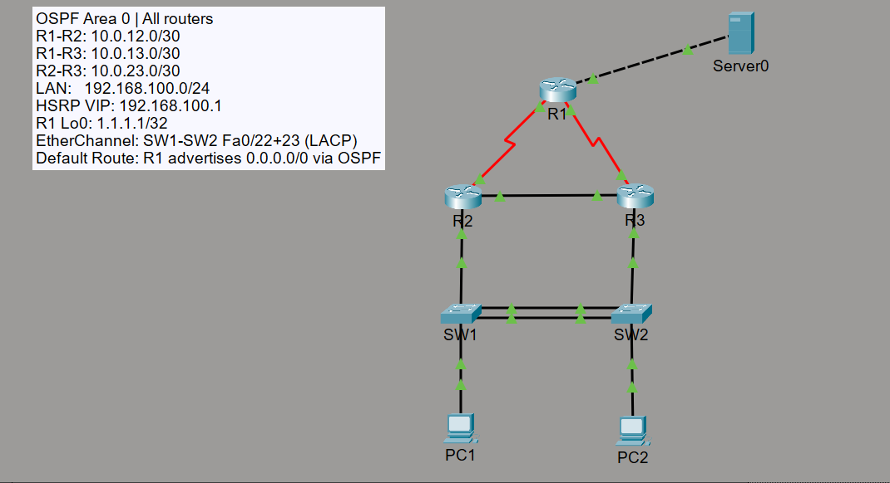

# Lab 2: Single-Area OSPF with Redundancy

## Overview
This lab simulates a multi-router network running OSPF in a single area (Area 0),
with redundancy at the access layer provided by HSRP (Hot Standby Router Protocol)
and EtherChannel between the two access switches. The topology includes a redundant
OSPF path between R2 and R3, so if one router-to-router link fails, OSPF reconverges
automatically and reroutes traffic without manual intervention.

## Topology

## Devices

| Device | Role                        | Model           |
|--------|-----------------------------|-----------------|
| R1     | Core Router / Default Route | Cisco 2911      |
| R2     | Distribution Router         | Cisco 2911      |
| R3     | Distribution Router         | Cisco 2911      |
| SW1    | Access Switch               | Cisco 2960-24TT |
| SW2    | Access Switch               | Cisco 2960-24TT |
| PC1    | Host (LAN)                  | PC-PT           |
| PC2    | Host (LAN)                  | PC-PT           |

## IP Addressing

### Point-to-Point Links

| Link    | Network        | Router A         | Router B         |
|---------|----------------|------------------|------------------|
| R1 ↔ R2 | 10.0.12.0/30   | R1 Se0/3/0 = 10.0.12.1 | R2 Se0/3/0 = 10.0.12.2 |
| R1 ↔ R3 | 10.0.13.0/30   | R1 Se0/3/1 = 10.0.13.1 | R3 Se0/3/0 = 10.0.13.2 |
| R2 ↔ R3 | 10.0.23.0/30   | R2 Gig0/1 = 10.0.23.1  | R3 Gig0/1 = 10.0.23.2  |

### LAN Segment

| Device              | IP Address       | Role                        |
|---------------------|------------------|-----------------------------|
| R2 Gig0/0           | 192.168.100.2/24 | HSRP Standby                |
| R3 Gig0/0           | 192.168.100.3/24 | HSRP Active                 |
| HSRP Virtual IP     | 192.168.100.1/24 | PC default gateway          |
| PC1 & PC2           | static           | Hosts in 192.168.100.0/24   |

### Loopback

| Device | Interface | IP          | Purpose                    |
|--------|-----------|-------------|----------------------------|
| R1     | Lo0       | 1.1.1.1/32  | Simulated remote network   |

## Interconnects

| Link                  | Interface(s)                        | Type                  |
|-----------------------|--------------------------------------|-----------------------|
| R1 ↔ R2               | R1 Se0/3/0 ↔ R2 Se0/3/0             | Serial (DCE/DTE)      |
| R1 ↔ R3               | R1 Se0/3/1 ↔ R3 Se0/3/0             | Serial (DCE/DTE)      |
| R2 ↔ R3               | R2 Gig0/1 ↔ R3 Gig0/1               | Copper (redundant path)|
| R2 ↔ SW1              | R2 Gig0/0 ↔ SW1 Fa0/24              | Copper                |
| R3 ↔ SW2              | R3 Gig0/0 ↔ SW2 Fa0/24              | Copper                |
| SW1 ↔ SW2 (link 1)    | SW1 Fa0/22 ↔ SW2 Fa0/22             | EtherChannel (LACP)   |
| SW1 ↔ SW2 (link 2)    | SW1 Fa0/23 ↔ SW2 Fa0/23             | EtherChannel (LACP)   |
| SW1 ↔ PC1             | SW1 Fa0/1 ↔ PC1 Fa0                 | Copper                |
| SW2 ↔ PC2             | SW2 Fa0/1 ↔ PC2 Fa0                 | Copper                |

## OSPF Design

| Detail          | Value                        |
|-----------------|------------------------------|
| Process ID      | 1                            |
| Area            | 0 (single area, all routers) |
| Router IDs      | R1=1.1.1.1 |
| Default route   | R1 advertises 0.0.0.0/0 via `default-information originate` |

## EtherChannel Design

| Detail            | Value                          |
|-------------------|--------------------------------|
| Physical links    | SW1/SW2 Fa0/22 and Fa0/23      |
| Protocol          | LACP (mode active, both sides) |
| Logical interface | Port-channel 1                 |
| Mode              | Trunk                          |

## HSRP Design

| Detail         | Value                  |
|----------------|------------------------|
| Group          | 1                      |
| Virtual IP     | 192.168.100.1          |
| Active router  | R3 (priority 110)      |
| Standby router | R2 (priority 90)       |
| Preempt        | Enabled on R3          |

## What Was Configured
- Single-area OSPF (Area 0) on all 3 routers with manually set router IDs
- OSPF cost manually adjusted on at least one interface to influence path selection
- Default route advertised into OSPF from R1 using `default-information originate always`
- R1 loopback (1.1.1.1/32) advertised into OSPF to simulate a remote network
- EtherChannel (LACP) bundling two physical links between SW1 and SW2
- HSRP group 1 on R2 and R3 — R3 active, R2 standby, preempt enabled on R3
- PCs configured to use HSRP virtual IP (192.168.100.1) as default gateway

## Security Design Notes
- OSPF neighbor relationships rely on link-state advertisements — in a production
  network, OSPF MD5 authentication would be added between neighbors to prevent
  a rogue router from injecting false routes into the OSPF domain. This ties
  directly to the integrity principle of the CIA triad (Sec+ concept).
- HSRP provides gateway redundancy, ensuring availability (another CIA triad
  pillar) is maintained even if the active router fails.

## Testing & Verification
- ✅ `show ip ospf neighbor` confirms FULL adjacency on all router pairs
- ✅ `show ip route ospf` on R2 shows OSPF-learned routes to all subnets
- ✅ PC1 successfully pings R1 loopback (1.1.1.1) — end-to-end OSPF routing confirmed
- ✅ `show standby brief` confirms R3 is Active, R2 is Standby before failover
- ✅ `show etherchannel summary` shows Port-channel1 bundled and up
- ✅ After shutting R3 Gig0/0 — R2 becomes Active (HSRP failover confirmed)
- ✅ After shutting R1 Se0/0/0 — R2 reroutes traffic via R3 (OSPF reconvergence confirmed)

Screenshots of each test are in [`/screenshots`](./screenshots).

## Configuration Files
Full running-configs for each device are available in [`/configs`](./configs).

## Lessons / What I'd Improve
- In a production network I would enable OSPF MD5 authentication between
  all neighbors to prevent unauthorized routers from joining the OSPF domain
  and injecting false routing information.
- I would replace the static HSRP priority configuration with an object
  tracking setup — so HSRP priority automatically decreases if an upstream
  interface goes down, triggering a more intelligent failover rather than
  just a LAN-facing interface failure.
- For the EtherChannel, I would also configure LACP fast timers to reduce
  the detection time for a failed link in the bundle.
