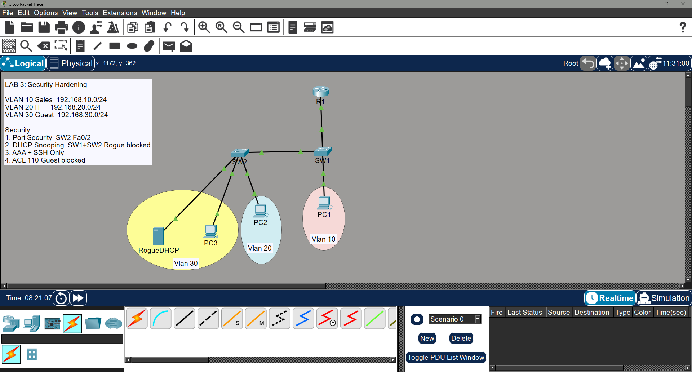

# Lab 3: Network Security Hardening

## Overview
This lab demonstrates baseline network security controls applied to a working
VLAN-segmented LAN. Controls include port security, DHCP snooping, AAA local
authentication, SSH-only access, and extended ACLs restricting Guest VLAN
lateral movement. Each control is documented with the threat it defends against
and its corresponding CIA triad pillar.

## Topology

## Devices

| Device | Role | Model |
|--------|------|-------|
| R1 | Router / DHCP Server | Cisco 2911 |
| SW1 | Core Access Switch | Cisco 2960-24TT |
| SW2 | Access Switch | Cisco 2960-24TT |
| PC1 | Sales host (VLAN 10) | PC-PT |
| PC2 | IT host (VLAN 20) | PC-PT |
| PC3 | Guest host (VLAN 30) | PC-PT |
| RogueDHCP | Simulated rogue DHCP server | Server-PT |

## VLAN & IP Addressing

| VLAN | Name | Subnet | Gateway | Device |
|------|------|--------|---------|--------|
| 10 | Sales | 192.168.10.0/24 | 192.168.10.1 | PC1 |
| 20 | IT | 192.168.20.0/24 | 192.168.20.1 | PC2 |
| 30 | Guest | 192.168.30.0/24 | 192.168.30.1 | PC3, RogueDHCP |

## Interconnects

| Link | Interface(s) | Type |
|------|-------------|------|
| R1 ↔ SW1 | R1 Gig0/0 ↔ SW1 Fa0/24 | Trunk |
| SW1 ↔ SW2 | SW1 Fa0/1 ↔ SW2 Fa0/24 | Trunk |
| SW1 ↔ PC1 | SW1 Fa0/2 ↔ PC1 Fa0 | Access VLAN 10 |
| SW2 ↔ PC2 | SW2 Fa0/1 ↔ PC2 Fa0 | Access VLAN 20 |
| SW2 ↔ PC3 | SW2 Fa0/2 ↔ PC3 Fa0 | Access VLAN 30 |
| SW2 ↔ RogueDHCP | SW2 Fa0/3 ↔ RogueDHCP Fa0 | Access VLAN 30 |

## What Was Configured

- Router-on-a-stick on R1 with one sub-interface per VLAN
- DHCP configured on R1 for all three VLANs
- Port security on SW2 Fa0/2 — sticky MAC, max 1, violation shutdown
- DHCP snooping on SW1 and SW2 — trusted ports toward R1 and inter-switch link only
- AAA local authentication on R1, SW1, SW2 — username/password required for all access
- SSH version 2 configured on all devices — Telnet disabled on all VTY lines
- Extended ACL 110 applied inbound on R1 Gig0/0.30 — blocks Guest from Sales and IT

## Threat Model

| Control | Threat it defends against | CIA Pillar |
|---------|--------------------------|------------|
| Port security | Unauthorized device plugged into access port | Confidentiality |
| DHCP snooping | Rogue DHCP server handing out malicious config | Integrity |
| AAA local auth | Unauthenticated device management access | Confidentiality |
| SSH only | Credential theft via plaintext Telnet | Confidentiality |
| Extended ACL | Guest lateral movement into internal VLANs | Confidentiality |

## Security Design Notes
- DHCP snooping trusted ports were carefully selected to follow the legitimate
  DHCP reply path: R1 → SW1 Fa0/24 → SW1 Fa0/1 → SW2 Fa0/24. All other ports
  remain untrusted, blocking the rogue DHCP server on SW2 Fa0/3.
- ACLs are stateless — blocking Guest outbound also prevents reply traffic from
  reaching Guest, effectively isolating the segment in both directions.
- In production, AAA would point to a centralized TACACS+ or RADIUS server
  instead of a local database, providing centralized logging and accounting.

## Testing & Verification
- ✅ Port security violation triggered on SW2 Fa0/2 — Port Status: Secure-shutdown, Violation Count: 1
- ✅ DHCP snooping enabled on VLANs 10, 20, 30 — rogue server offers blocked
- ✅ SSH version 2 confirmed working — successful login from PC1 to R1
- ❌ Telnet refused — connection closed by foreign host
- ✅ Guest (PC3) blocked from pinging Sales (PC1) — 100% packet loss
- ✅ Guest (PC3) blocked from pinging IT (PC2) — 100% packet loss
- ✅ Sales (PC1) successfully pings IT (PC2) — inter-VLAN routing confirmed
- ✅ show access-lists confirms non-zero match counters on deny lines

Screenshots of each test are in [`/screenshots`](./screenshots).

## Configuration Files
Full running-configs for each device are available in [`/configs`](./configs).

## Lessons / What I'd Improve
- DHCP snooping required careful analysis of the full packet path to identify
  which ports needed to be trusted — a good reminder that security controls
  must account for legitimate traffic flows, not just attack vectors.
- In production I would add 802.1X port authentication instead of static port
  security, providing dynamic per-user authentication at the access layer.
- OSPF MD5 authentication would be added if routing protocols were in use,
  tying network security directly to the integrity pillar of the CIA triad.
- Centralized syslog and SIEM integration would replace local buffered logging
  for real-time alerting on denied traffic and security events.
